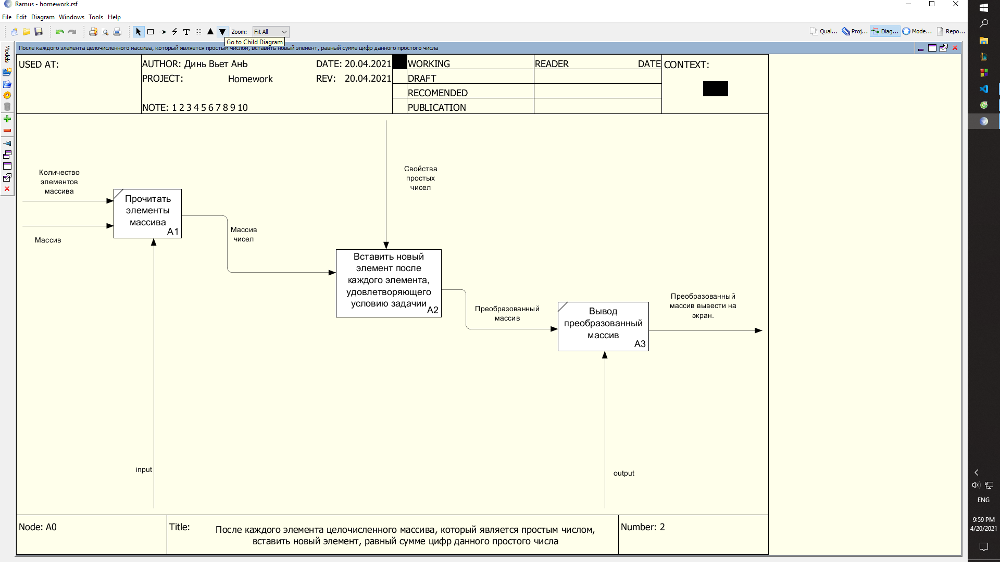
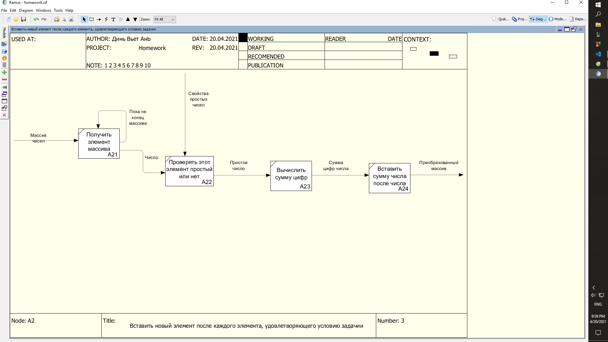

# Домашнее задание
# Вариант №8

### Условие задачи:
После каждого элемента целочисленного массива, который является простым числом, вставить новый элемент, равный сумме цифр данного простого числа. Преобразованный массив вывести на экран.

