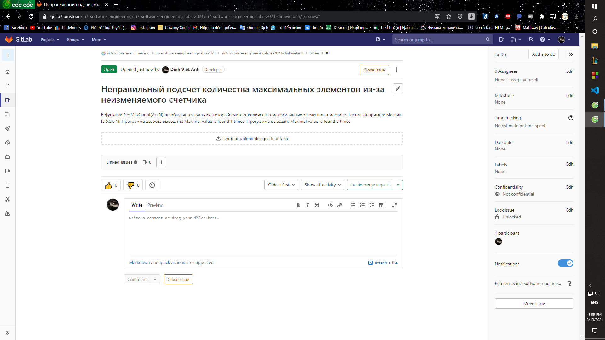
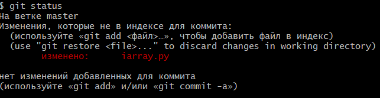
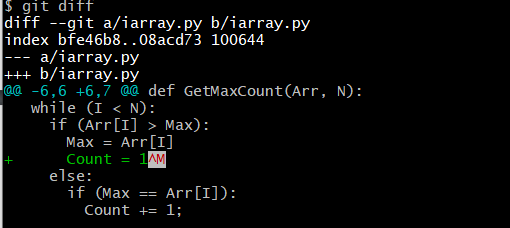
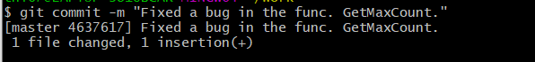
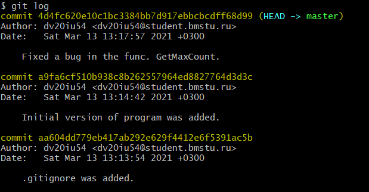
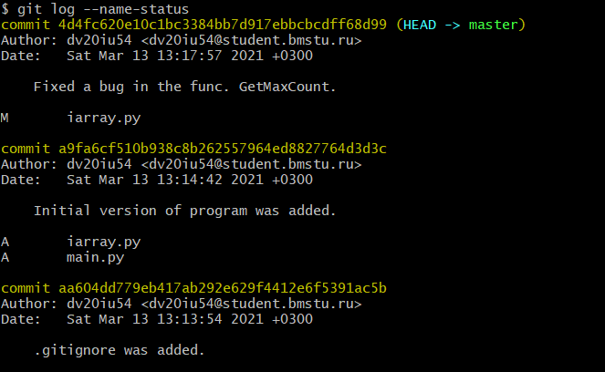

# 0. Подготовительные моменты

### Прочитаны все методические указания.

### Создан локальный репозиторий и исходная программа помещена под версионный контроль.

1) Запуск командной оболочки MSYS2.
2) Проверка с помощью команды *pwd*, в какой папке я нахожусь

3) Анализ содержимого папки при помощи команды *ls* с ключом *-а*, который выводит в консоль все имена, в том числе которые начинаются с точки.

```
$ ls -a
.   .bash_history  .bash_profile  .gnupg    .profile
..  .bash_logout   .bashrc        .inputrc
````


```
$ pwd
/home/tni67
```
Одна точка "." - короткое имя текущей папки (в данном случае "/home/tni67")
Две точки ".." - короткое имя "родительской папки" (в данном случае "/home")

4) Создание отдельной папки (work) для выполнения лабораторной работы в домашней папке. Для создания папки используется команда *mkdir*.
```
$ mkdir work
```

4) Использование команды *-cd* для перехода по папкам:
Перейдем в папку work, используя относительный путь:
```
$ cd work
$ pwd
/home/tni67/work
```

Вернемся в «домашнюю» папку:
```
$ cd ..
$ pwd
/home/tni67
```

Перейдем в папку work, используя абсолютный путь:
```
$ cd /home/tni67/work
$ pwd
/home/tni67/work
```

Чтобы попасть в «домашнюю» папку из любой другой папки можно воспользоваться командой *cd ~*

```
$ cd ~
$ pwd
/home/tni67
```

5)Создание локального репозитория с помощью команды *git init*.
```
$ git init
```

Инициализирован пустой репозиторий Git в /home/tni67/work/.git/
Убедимся, что папка теперь непустая:
```
$ ls -a
.  ..  .git
```
### Подготовка к работе
1)Проверка, задано ли имя пользователя и адрес электронной почты:
```
$ git config --list
core.repositoryformatversion=0
core.filemode=false
core.bare=false
core.logallrefupdates=true
core.symlinks=false
core.ignorecase=true
```

2)В выдаче отсутствуют переменные *user.name* и *user.email*, значит имя и адрес
электронной почты не заданы. 
Установка значений для этих переменных.

```
$ git config user.name dv20iu54
$ git config user.email dv20iu54@student.bmstu.ru
$ git config --list
core.repositoryformatversion=0
core.filemode=false
core.bare=false
core.logallrefupdates=true
core.symlinks=false
core.ignorecase=true
user.name=dv20iu54
user.email=dv20iu54@student.bmstu.ru
```

3) Размещение в папке для выполнения лабораторной работы исходного кода программы из архива, проверка:
```
$ pwd
/home/tni67/work
$ ls
iarray.py  main.py
```

4) Запуск программы, чтобы убедиться, что программа работает на тестовом примере.
После запуска программы в папке лабораторной работы work появилась папка
*__pycache__*, которая содержит байт-код Python.

```
$ ls
__pycache__  iarray.py  main.py
```

5)Чтобы сообщить git какие файлы не нужно отслеживать, создаю специальный файл, который называется .gitignore. Он располагается в папке */home/tni67/work*
В командной оболочке, командой *touch .gitignore* создаю файл, а  после его создания редактирую его с помощью Блокнота (добавляю строку **/__pycache__/**)
```
$ touch .gitignore
```

проверка:
```
$ git status
На ветке master
Еще нет коммитов
Неотслеживаемые файлы:
  (используйте «git add <файл>…», чтобы добавить в то, что будет включено в коммит)
        .gitignore
        iarray.py
        main.py
ничего не добавлено в коммит, но есть неотслеживаемые файлы (используйте «git add», чтобы отслеживать их)
```

Добавляем файл *.gitignore* при помощи команды *git add*:
```
$ git add .gitignore

$ git status
На ветке master
Еще нет коммитов
Изменения, которые будут включены в коммит:
  (используйте «git rm --cached <файл>…», чтобы убрать из индекса)
        новый файл:    .gitignore
Неотслеживаемые файлы:
  (используйте «git add <файл>…», чтобы добавить в то, что будет включено в коммит)
        iarray.py
        main.py
```

6)Фиксация изменений:
```
$ git commit -m ".gitignore was added."
[master (корневой коммит) 452l785] .gitignore was added.
 1 file changed, 1 insertion(+)
 create mode 100644 .gitignore
```

Команда *commit* отображает информацию о фиксации: имя ветки, в которой выполнена
фиксация (master), контрольную сумму фиксации (452l785), сколько файлов было изменено,
статистику по добавленным/удаленным строкам.

7)Добавим под версионный контроль самой программы (Благодаря .gitignore, папка __pycache__  будет проигнорирована) и фиксация изменений:

```
$ git add iarray.py main.py
$ git status
На ветке master
Изменения, которые будут включены в коммит:
  (use "git restore --staged <file>..." to unstage)
        новый файл:    iarray.py
        новый файл:    main.py
$ git commit -m "Initial version of program was added."
[master gh45632] Initial version of program was added.
 2 files changed, 36 insertions(+)
 create mode 100644 iarray.py
 create mode 100644 main.py
```

# 1. Назначение программы.

Данная программа считает количество максимумов в массиве.

Функция *main()* запускает программу, печатает результат.

Функция *Test1()* создает массив из 5 элементов, в котором требуется подсчитать количество максимальных элементов.

Функция *GetMaxCount()* считает количество максимальных элементов в переданном ей массиве.

# 2. Поиск ошибки и ее описание

Тест, при котором программа работает неверно:

```py
def Test1():
  Arr = list()

  Arr.append(5)
  Arr.append(5)
  Arr.append(5)
  Arr.append(6)
  Arr.append(1)
  
  return Arr, 5
```

Список, который программа получает [5,5,5,6,1]

Программа должна вывести: *Maximal value is found 1 times.*

Программа выводит: *Maximal value is found 3 times.*

### Отчет об ошибке(*issue*), созданный в *GitLab*:



Issue создала, назначила сама на себя. После испавления ошибки, в  issue был добавлен коментарий о том, что ошибка исправлена и так же был указан номер ревиции.


### Анализ исправления с помощью *git status* и *git diff*:




Из данных, полученных с помощью *git status* и *git diff*, мы видим, что файл *iarray.py* изменился(добавили одну строку).

### Изменения зафиксированы: 



# 3. Анализ истории

### Зафиксированные изменения с помощью *git log*.



С помощью команды *git log* мы получили список коммитов в обратном хронологическом порядке.
 
Формат:
```
commit <SHA-1 коммита>
Author: <user.name> <<user.email>>
Date:   <дата создания>
```

### Зафиксированные изменения с помощью *git log --name-status*.



С помощью команды *git log --name-status* мы получаем так же список файлов, которые были изменены/добавлены/удалены (A - добавлены, D - удалены, M - изменены).

# Работа с Gitlab

Можно так же отследить изменения с помощью GitLab.
Для этого надо зайти в свой репозиторий (...iu7-cprog-labs-2021/iu7-cprog-labs-2021-dinhvietanh...).

Далее в меню, которое находится слева, зайти в папку *Repository*, далее в раздел *commit*.

И в этой папке мы видим все наши изменения.