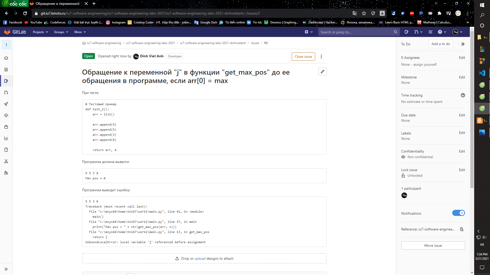

# Задание 1
# 1.Создание локального репозитория.

1) Создание отдельной папки (work2) для выполнения лабораторной работы в домашней папке. Для создания папки используется команда *mkdir*.
```
$ mkdir work2
```
2) Использование команды *-cd* для перехода по папкам:
Перейдем в папку work2, используя относительный путь:
```
$ cd work2
$ pwd
/home/tni67/work2
```
3) Создание локального репозитория с помощью команды *git init*.
```
$ git init
```

Инициализирован пустой репозиторий Git в /home/tni67/work2/.git/
Убедимся, что папка теперь непустая:
```
$ ls -a
.  ..  .git
```

### Подготовка к работе
1)Проверка, задано ли имя пользователя и адрес электронной почты:
```
$ git config --list
core.repositoryformatversion=0
core.filemode=false
core.bare=false
core.logallrefupdates=true
core.symlinks=false
core.ignorecase=true
```

2)В выдаче отсутствуют переменные *user.name* и *user.email*, значит имя и адрес
электронной почты не заданы. 
Установка значений для этих переменных.

```
$ git config user.name dv20iu54
$ git config user.email dv20iu54@student.bmstu.ru
$ git config --list
core.repositoryformatversion=0
core.filemode=false
core.bare=false
core.logallrefupdates=true
core.symlinks=false
core.ignorecase=true
user.name=dv20iu54
user.email=dv20iu54@student.bmstu.ru
```

3) Размещение в папке для выполнения лабораторной работы исходного кода программы из архива, проверка:
```
$ pwd
/home/tni67/work2
$ ls
iarray.py  main.py
```

4) Запуск программы, чтобы убедиться, что программа работает на тестовом примере.
После запуска программы в папке лабораторной работы work появилась папка
*__pycache__*, которая содержит байт-код Python.

```
$ ls
__pycache__  iarray.py  main.py
```

# 2.Создание файла *.gitignore* и помещение под версионный контроль.

1) Чтобы сообщить git какие файлы не нужно отслеживать, создаю специальный файл, который называется .gitignore. Он располагается в папке */home/tni67/work*
В командной оболочке, командой *touch .gitignore* создаю файл, а  после его создания редактирую его с помощью Блокнота (добавляю строку **/__pycache__/**)
```
$ touch .gitignore
```

проверка:
```
$ git status
На ветке master
Еще нет коммитов
Неотслеживаемые файлы:
  (используйте «git add <файл>…», чтобы добавить в то, что будет включено в коммит)
        .gitignore
        iarray.py
        main.py
ничего не добавлено в коммит, но есть неотслеживаемые файлы (используйте «git add», чтобы отслеживать их)
```

Добавляем файл *.gitignore* при помощи команды *git add*:
```
$ git add .gitignore

$ git status
На ветке master
Еще нет коммитов
Изменения, которые будут включены в коммит:
  (используйте «git rm --cached <файл>…», чтобы убрать из индекса)
        новый файл:    .gitignore
Неотслеживаемые файлы:
  (используйте «git add <файл>…», чтобы добавить в то, что будет включено в коммит)
        iarray.py
        main.py
```

2) Фиксация изменений:
```
$ git commit -m ".gitignore was added"
[master (корневой коммит) 1943b9c] .gitignore was added
 1 file changed, 1 insertion(+)
 create mode 100644 .gitignore
```

Команда *commit* отображает информацию о фиксации: имя ветки, в которой выполнена
фиксация (master), контрольную сумму фиксации (192o985), сколько файлов было изменено,
статистику по добавленным/удаленным строкам.

3) Добавим под версионный контроль самой программы (Благодаря .gitignore, папка __pycache__  будет проигнорирована) и фиксация изменений:

```
$ git add iarray.py main.py
$ git status
На ветке master
Изменения, которые будут включены в коммит:
  (use "git restore --staged <file>..." to unstage)
        новый файл:    iarray.py
        новый файл:    main.py
$ git commit -m "Initial version of program was added"
[master 91b5211] Initial version of program was added
 2 files changed, 45 insertions(+)
 create mode 100644 iarray.py
 create mode 100644 main.py
```

# 3. Создание отдельной ветки для исправления ошибки.

Создаем отдельную ветвь для исправления ошибки (для этого используем команду *git branch*). Ветвь называется fix. Переключились на нее с помощью *git checkout fix*

```
$ git branch fix

$ git checkout fix
Переключено на ветку «fix»

$ git branch
* fix
  master
```

# 4. Добавление комментариев, описывающих назначение функции программы.

```
$ git diff
diff --git a/iarray.py b/iarray.py
index b0b6360..132e53f 100644
--- a/iarray.py
+++ b/iarray.py
@@ -1,3 +1,4 @@
+# Поиск позиции максимального элемента^M
 def get_max_pos(arr, n):
   max = arr[0];

@@ -11,7 +12,7 @@ def get_max_pos(arr, n):

   return j

-
+# Вывод массива  ^M
 def print_array(arr, n):
   i = 0
   while (i < n):
diff --git a/main.py b/main.py
index c5dbf8e..aa4c468 100644
--- a/main.py
+++ b/main.py
@@ -1,5 +1,6 @@
 from iarray import *

+# Тестовый пример^M
 def test_1():
   arr = list()

@@ -10,7 +11,7 @@ def test_1():

   return arr, 4

-
+# Главная функция^M
 def main():
   arr, n = test_1()

```
С помощью команды *git diff* мы видим, что написаны комментарии, которые описывают функции.

Далее с помощью команд *git commit* и *git add* и *git status* добавим изменения под версионный контроль и проверим их статус.

```
$ git status
На ветке fix
Изменения, которые будут включены в коммит:
  (use "git restore --staged <file>..." to unstage)
        изменено:      iarray.py
        изменено:      main.py

Изменения, которые не в индексе для коммита:
  (используйте «git add <файл>…», чтобы добавить файл в индекс)
  (use "git restore <file>..." to discard changes in working directory)
        изменено:      iarray.py
        изменено:      main.py

$ git add main.py iarray.py

$ git commit -m "All functions are commented"
[fix df83184] All functions are commented
 1 file changed, 2 insertions(+), 2 deletions(-)
```
# 5. Добавление теста.

Добавлен тест:
```py
# Тестовый пример
def test_2():
  arr = list()
  
  arr.append(9)
  arr.append(5)
  arr.append(3)
  arr.append(8)
  
  return arr, 4
```
Проанализируем историю изменения с помощью *git diff* и *git status*.

```
$ git diff
diff --git a/main.py b/main.py
index aa4c468..a2be051 100644
--- a/main.py
+++ b/main.py
@@ -11,6 +11,17 @@ def test_1():

   return arr, 4

+# Тестовый пример^M
+def test_2():^M
+  arr = list()^M
+  ^M
+  arr.append(9)^M
+  arr.append(5)^M
+  arr.append(3)^M
+  arr.append(8)^M
+  ^M
+  return arr, 4^M
+^M
 # Главная функция
 def main():
   arr, n = test_1()
@@ -19,6 +30,12 @@ def main():

   print("Max pos = " + str(get_max_pos(arr, n)))

+  arr, n = test_2()^M
+^M
+  print_array(arr, n)^M
+  ^M
+  print("Max pos = " + str(get_max_pos(arr, n)))^M
+^M

 if __name__ == '__main__':
   main()

$ git status
На ветке fix
Изменения, которые не в индексе для коммита:
  (используйте «git add <файл>…», чтобы добавить файл в индекс)
  (use "git restore <file>..." to discard changes in working directory)
        изменено:      main.py

нет изменений добавленных для коммита
(используйте «git add» и/или «git commit -a»)

```
Мы видим, что в файл iarray.py внесены изменения, а именно добавлен новый тест.

Далее зафиксируем наши изменения с помощью команды *git add* и *git commit*.

```
$ git add main.py

$ git commit -m "Add incorrect test"
[fix fd52746] Add incorrect test
 1 file changed, 17 insertions(+)
```
 
# 6. Создание issue.

Описана ошибка, приведен тестовый пример, а так же вывод, который должен быть и который программа выводит.



# 7. Исправление ошибки.

После присваивания *max = arr[0]*, так же было присвоено значение 0 переменной j:

``` py
# Поиск позиции максимального элемента
def get_max_pos(arr, n):
  max = arr[0];
  j = 0
  i = 1
  while (i < n):
    if (arr[i] > max):
      max = arr[i]
      j = i
    
    i += 1

  return j

# Вывод массива  
def print_array(arr, n):
  i = 0
  while (i < n):
    print(arr[i], end = " ")
    i += 1
  
  print("")
```

Анализ изменений с помощью команд *git diff* *git status* *git add* *git commit*

Мы видим, что добавлена одна строчка *j = 0* (она отмечена знаком '+', а знаком '-' отмечены строчки, которые были заменены или удалены)

Далее добавляем это изменение под версионный контроль.

```
$ git diff
diff --git a/iarray.py b/iarray.py
index 132e53f..9c1f2cc 100644
--- a/iarray.py
+++ b/iarray.py
@@ -1,7 +1,7 @@
 # Поиск позиции максимального элемента
 def get_max_pos(arr, n):
   max = arr[0];
-
+  j = 0^M
   i = 1
   while (i < n):
     if (arr[i] > max):

$ git status
На ветке fix
Изменения, которые не в индексе для коммита:
  (используйте «git add <файл>…», чтобы добавить файл в индекс)
  (use "git restore <file>..." to discard changes in working directory)
        изменено:      iarray.py

нет изменений добавленных для коммита
(используйте «git add» и/или «git commit -a»)

$ git add iarray.py

$ git commit -m "Fixed a bug in the function"
[fix 2124407] Fixed a bug in the function
 1 file changed, 1 insertion(+), 1 deletion(-)
```

# 8. Выполнение объединений изменений с веткой master.

Переключились на ветку master и выполнили объединение изменений (для этого
используется команда git merge)

Конфликта не произошло.

```
$ git checkout master
Переключено на ветку «master»

$ git merge fix
Обновление 91b5211..2124407
Fast-forward
 iarray.py |  5 +++--
 main.py   | 20 +++++++++++++++++++-
 2 files changed, 22 insertions(+), 3 deletions(-)

$ git status
На ветке master
нечего коммитить, нет изменений в рабочем каталоге
```
# 9. Анализ изменения с помощью команды *git log --oneline --graph --all*

```
$ git log --oneline --graph --all
* 2124407 (HEAD -> master, fix) Fixed a bug in the function
* fd52746 Add incorrect test
* df83184 All functions are commented
* e638e3f All funcions are commented
* 91b5211 Initial version of program was added
* 1943b9c .gitignore was added
```

При вызове команды *git log --oneline --graph --all* мы наблюдаем историю изменений за весь период в обратном хронологическом порядке вместе с комментариями.

Конфликта не было, так как лишь один пользователь вносил изменения.
 Конфликт возникает в том случае, если 2 разных пользователя вносят изменения в проект в одно и то же время, из-за этого система не может понять какое изменение вносить и предоставляет сделать этот выбор пользователям.

 # Задание 2

### 1.
Распаковали репозиторий.
### 2.
Проанализировали историю изменений в этом репозитории.

В данном репозитории есть 2 ветки: master и develop.

Активна ветка master.
```
$ git branch
  develop
* master
```

На ветке master работал один пользователь.
```
$ git log
commit 1295f707870f0e1c13e9144b03cbef4bd10b52a7 (HEAD -> master)
Author: Minstrel <minstrel@test>
Date:   Tue Mar 13 17:01:15 2018 +0300

    Couplet #4.

commit 4fcbc684b3e8a22c172a218107bd669e0768b9f4
Author: Minstrel <minstrel@test>
Date:   Tue Mar 13 17:00:30 2018 +0300

    Couplet #3.

commit 122ee3aeeea5f70e6a933bf0f4afbaa436e57b25
Author: Minstrel <minstrel@test>
Date:   Tue Mar 13 16:57:10 2018 +0300

    Couplet #1.

commit f739d2e40e87639a7fbb1d2a1333944164f879be
Author: Minstrel <minstrel@test>
Date:   Tue Mar 13 16:50:47 2018 +0300

    Beginning.
```

Переключимся на ветку develop и посмотрим сколько там пользователей работало.

На ветке develop работало 2 пользователя.

```
$ git checkout develop
Переключено на ветку «develop»

$ git log
commit a52c4ec45e14d5b48095e1bc9c569f06f4838362 (HEAD -> develop)
Author: Songster <songster@test>
Date:   Tue Mar 13 17:03:38 2018 +0300

    Couplets #5 and #6.

commit 2c605117c7fe0fc2452e787b44519f212ce48bcc
Author: Songster <songster@test>
Date:   Tue Mar 13 16:59:09 2018 +0300

    Couplet #2.

commit f739d2e40e87639a7fbb1d2a1333944164f879be
Author: Minstrel <minstrel@test>
Date:   Tue Mar 13 16:50:47 2018 +0300

    Beginning.
```

В репозитории расположен 1 файл: song.txt

Данный файл изменяли 2 пользователя: Songster и Minstrel.

Последовательность изменений представлена выше в обратном хронологическом порядке.


### 3.

При слиянии изменений произошел конфликт
```
$ git merge master
Автослияние song.txt
КОНФЛИКТ (содержимое): Конфликт слияния в song.txt
Не удалось провести автоматическое слияние; исправьте конфликты и сделайте коммит результата.
```
1) Так сразу 2 пользователя внесли изменения в данный файл, то git не создал фиксацию автоматически, он остановил процесс до тех пор, пока мы сами не решим этот конфликт

2)Проверим статус файлов на ветке develop:

```
$ git status
На ветке develop
У вас есть не слитые пути.
  (разрешите конфликты, затем запустите «git commit»)
  (используйте «git merge --abort», чтобы остановить операцию слияния)

Не слитые пути:
  (используйте «git add <файл>…», чтобы пометить разрешение конфликта)
        оба изменены:   song.txt

нет изменений добавленных для коммита
(используйте «git add» и/или «git commit -a»)
```

Файл song.txt до исправления:
```
<<<<<<< HEAD
Метель ей пела песенку:
«Спи, ёлочка, бай-бай!»
Мороз снежком укутывал:
«Смотри, не замерзай!»

Везёт лошадка дровенки,
На дровнях - мужичок
Срубил он нашу ёлочку
Под самый корешок.

Теперь она, нарядная,
На праздник к нам пришла,
И много, много радости
Детишкам принесла.
=======
В лесу родилась ёлочка,
В лесу она росла.
Зимой и летом стройная,
Зелёная была.

Трусишка зайка серенький
Под ёлочкой скакал.
Порою волк, сердитый волк,
Рысцою пробегал.

Чу! Снег по лесу частому
Под полозом скрипит.
Лошадка мохноногая
Торопится, бежит.
>>>>>>> master
```

Файл song.txt имеет 2 изменения, и git предлагает соединить эти изменения самим.

Самостоятельно выполнили объединение изменений и добились расположения абзацев текста песни в правильной логической последовательности.

Файл song.txt после изменения:
```
В лесу родилась ёлочка,
В лесу она росла.
Зимой и летом стройная,
Зелёная была.

Метель ей пела песенку:
«Спи, ёлочка, бай-бай!»
Мороз снежком укутывал:
«Смотри, не замерзай!»

Трусишка зайка серенький
Под ёлочкой скакал.
Порою волк, сердитый волк,
Рысцою пробегал.

Чу! Снег по лесу частому
Под полозом скрипит.
Лошадка мохноногая
Торопится, бежит.

Везёт лошадка дровенки,
На дровнях - мужичок
Срубил он нашу ёлочку
Под самый корешок.

Теперь она, нарядная,
На праздник к нам пришла,
И много, много радости
Детишкам принесла
```
После изменения файла song.txt, происходит автослияние с веткой master.

# Задание 3

### Задание 3.1

Создана ветвь с именем lab_01, в которой расположены коды решенных задач. Создан [merge request](https://git.iu7.bmstu.ru/iu7-cprog/iu7-cprog-labs-2021/iu7-cprog-labs-2021-dinhvietanh/-/merge_requests/5)

### Задание 3.2

Для получения копии удаленного репозитория необходимо воспользоваться командой ***git clone***.

```
$ git clone https://git.iu7.bmstu.ru/iu7-software-engineering/iu7-software-engineering-labs-2021/iu7-software-engineering-labs-2021-dinhvietanh.git
Клонирование в «iu7-software-engineering-labs-2021-dinhvietanh»…
Username for 'https://git.iu7.bmstu.ru':
Password for 'https://dv20iu54@git.iu7.bmstu.ru':
remote: Enumerating objects: 3, done.
remote: Counting objects: 100% (3/3), done.
remote: Compressing objects: 100% (2/2), done.
remote: Total 3 (delta 0), reused 0 (delta 0), pack-reused 0
Распаковка объектов: 100% (3/3), готово.
```

Перейдем в рабочую директорию ***iu7-software-engineering-labs-2021-dinhvietanh***.

Создаем ветки *lab_02_a* и *lab_02_b* при помощи команды ***git_branch***. И переключимся на ветку *lab_02_a*.

```
$ cd iu7-software-engineering-labs-2021-dinhvietanh
$ git branch lab_02_a

$ git branch lab_02_b

$ git branch
  lab_02_a
  lab_02_b
* master
```

### Работа с веткой lab_02_a

Создаем файл *lab_02_a.txt* и файл *.gitignore* и добавляем их под версионный контроль.
```
$ touch .gitignore

$ touch lab_02_a.txt

$ git add .gitignore lab_02_a.txt

$ git commit -m "Added lab_02_a.txt and .gitignore"
[master a6c13f8] Added lab_02_a.txt and .gitignore
 2 files changed, 0 insertions(+), 0 deletions(-)
 create mode 100644 .gitignore
 create mode 100644 lab_02_a.txt

```
Отправляем изменения в удаленный репозиторий при помощи команды ***git push***

```
$ git push --set-upstream origin lab_02_a
Username for 'https://git.iu7.bmstu.ru':
Password for 'https://dv20iu54@git.iu7.bmstu.ru':
Total 0 (delta 0), reused 0 (delta 0), pack-reused 0
remote:
remote: To create a merge request for lab_02_a, visit:
remote:   https://git.iu7.bmstu.ru/iu7-software-engineering/iu7-software-engineering-labs-2021/iu7-software-engineering-labs-2021-dinhvietanh/-/merge_requests/new?merge_request%5Bsource_branch%5D=lab_02_a
remote:
To https://git.iu7.bmstu.ru/iu7-software-engineering/iu7-software-engineering-labs-2021/iu7-software-engineering-labs-2021-dinhvietanh.git
 * [new branch]      lab_02_a -> lab_02_a
Branch 'lab_02_a' set up to track remote branch 'lab_02_a' from 'origin'.
```

### Работа с веткой lab_02_b.

Создаем файл *lab_02_b.txt* и *.gitignore* и добавляем их под версионный контроль.
```
$ git checkout lab_02_b
Переключено на ветку «lab_02_b»

$ touch lab_02_b.txt

$ touch .gitignore

$ git add .gitignore lab_02_b.txt

$ git commit -m "Added: lab_02_b.txt and .gitignore"
[lab_02_b 3d78f0a] Added: lab_02_b.txt and .gitignore
 2 files changed, 2 insertions(+)
 create mode 100644 .gitignore
 create mode 100644 lab_02_b.txt

```
Отправляем изменения в удаленный репозиторий при помощи команды ***git push***.
```
$ git push --set-upstream origin lab_02_b
Username for 'https://git.iu7.bmstu.ru':
Password for 'https://dv20iu54@git.iu7.bmstu.ru':
Total 0 (delta 0), reused 0 (delta 0), pack-reused 0
remote:
remote: To create a merge request for lab_02_a, visit:
remote:   https://git.iu7.bmstu.ru/iu7-software-engineering/iu7-software-engineering-labs-2021/iu7-software-engineering-labs-2021-dinhvietanh/-/merge_requests/new?merge_request%5Bsource_branch%5D=lab_02_a
remote:
To https://git.iu7.bmstu.ru/iu7-software-engineering/iu7-software-engineering-labs-2021/iu7-software-engineering-labs-2021-dinhvietanh.git
 * [new branch]      lab_02_b -> lab_02_b
Branch 'lab_02_b' set up to track remote branch 'lab_02_b' from 'origin'.
```

### Разрешение конфликта.

Когда преподаватель принял Merge Request B, то возникает конфликт с Merge Request A. Так как есть два файла с одинаковым названием *.gitignore*, но с разным содержанием.

Чтобы решить данный конфликт требуется выбрать одну из версий файла *.gitignore*.
Для этого добавим в файл *.gitignore* строку "*.exe"

И сохраним наши изменения.

Tеперь конфликта в Merge Request A нет.

### Задание 3.3

Чтобы получить удаленный репозиторий, воспользуемся командой ***git clone***. И перейдем в рабочую директорию с помощью команды ***cd***.

```
$  git clone https://git.iu7.bmstu.ru/iu7-software-engineering/iu7-software-engineering-labs-2021/iu7-software-engineering-labs-2021-dinhvietanh.git
Cloning into 'iu7-software-engineering-labs-2021-dinhvietanh'...
Username for 'https://git.iu7.bmstu.ru':
Password for 'https://dv20iu54@git.iu7.bmstu.ru':
remote: Enumerating objects: 3, done.
remote: Counting objects: 100% (3/3), done.
remote: Compressing objects: 100% (2/2), done.
remote: Total 3 (delta 0), reused 0 (delta 0), pack-reused 0
Receiving objects: 100% (3/3), done.
```

### Работа с текстовым файлом, создание конфликта.

Создадим ветвь lab_02_c c помощью команды ***git branch*** и переключимся на ветку lab_02_c.

```

$ cd iu7-software-engineering-labs-2021-dinhvietanh

$ git branch lab_02_c

$ git checkout lab_02_c
Переключено на ветку «lab_02_c»
```

Создаем файл lab_02_c.txt и добавляем его под версионный контроль.

```
$ touch lab_02_c.txt

$ git add lab_02_c.txt

$ git commit -m "Added: lab_02_c.txt"
[lab_02_c 90643da] Added: lab_02_c.txt
 1 file changed, 8 insertions(+)
 create mode 100644 lab_02_c.txt

```

Изменения в файле *lab_02_c.txt* отправляем в удаленный репозиторий при помощи команды ***git push*** 

```
$ git push --set-upstream origin lab_02_c
Username for 'https://git.iu7.bmstu.ru':
Password for 'https://dv20iu54@git.iu7.bmstu.ru':
Перечисление объектов: 4, готово.
Подсчет объектов: 100% (4/4), готово.
При сжатии изменений используется до 4 потоков
Сжатие объектов: 100% (3/3), готово.
Запись объектов: 100% (3/3), 422 bytes | 70.00 KiB/s, готово.
Всего 3 (изменения 0), повторно использовано 0 (изменения 0)
remote:
remote: To create a merge request for lab_02_c, visit:
remote:   https://git.iu7.bmstu.ru/iu7-software-engineering/iu7-software-engineering-labs-2021/iu7-software-engineering-labs-2021-dinhvietanh/merge_requests/new?merge_request%5Bsource_branch%5D=lab_02_c
remote:
To https://git.iu7.bmstu.ru/iu7-software-engineering/iu7-software-engineering-labs-2021/iu7-software-engineering-labs-2021-dinhvietanh.git
 * [new branch]      lab_02_c -> lab_02_c
Ветка «lab_02_c» отслеживает внешнюю ветку «lab_02_c» из «origin».
```
Далее добавляем абзац №3 в файл *lab_02_c.txt* и фиксируем данное изменение в локально репозитории.

```
$ git add lab_02_c.txt

$ git commit -m "Added: paragraph 3 in lab_02_c.txt"
[lab_02_c f81c2c4] Added: paragraph 3 in lab_02_c.txt
 1 file changed, 10 insertions(+), 1 deletion(-)

```
Клонируем удаленный репозиторий в новую папку.
```
$ git clone https://git.iu7.bmstu.ru/iu7-software-engineering/iu7-software-engineering-labs-2021/iu7-software-engineering-labs-2021-dinhvietanh.git
Клонирование в «iu7-software-engineering-labs-2021-dinhvietanh»…
Username for 'https://git.iu7.bmstu.ru':
Password for 'https://dv20iu54@git.iu7.bmstu.ru':
remote: Enumerating objects: 14, done.
remote: Counting objects: 100% (14/14), done.
remote: Compressing objects: 100% (8/8), done.
remote: Total 14 (delta 0), reused 0 (delta 0), pack-reused 0
Распаковка объектов: 100% (14/14), 1.22 KiB | 14.00 KiB/s, готово.

```
В файл *lab_02_c* добавляем абзац №2 и фиксируем данное изменение. Далее отправляем это изменение в удаленный репозиторий при помощи команды ***git push***.
```
$ git add lab_02_c.txt

$ git commit -m "Added paragraph 2 in lab_02_c.txt"
[lab_02_c c41a145] Added paragraph 2 in lab_02_c.txt
 1 file changed, 12 insertions(+), 1 deletion(-)

$ git push
Username for 'https://git.iu7.bmstu.ru':
Password for 'https://dv20iu54@git.iu7.bmstu.ru':
Перечисление объектов: 5, готово.
Подсчет объектов: 100% (5/5), готово.
При сжатии изменений используется до 4 потоков
Сжатие объектов: 100% (3/3), готово.
Запись объектов: 100% (3/3), 633 bytes | 126.00 KiB/s, готово.
Всего 3 (изменения 0), повторно использовано 0 (изменения 0)
remote:
remote: To create a merge request for lab_02_c, visit:
remote:   https://git.iu7.bmstu.ru/iu7-software-engineering/iu7-software-engineering-labs-2021/iu7-software-engineering-labs-2021-dinhvietanh/merge_requests/new?merge_request%5Bsource_branch%5D=lab_02_c
remote:
To https://git.iu7.bmstu.ru/iu7-software-engineering/iu7-software-engineering-labs-2021/iu7-software-engineering-labs-2021-dinhvietanh.git
   90643da..c41a145  lab_02_c -> lab_02_c
```

Возвращаемся в первую копию удаленного репозитория. И отправляем изменения в удаленный репозиторий.
```
$ cd ..

$ cd ..

$ cd work2_3.3

$ ls -a
.  ..  iu7-software-engineering-labs-2021-dinhvietanh

$ cd iu7-software-engineering-labs-21-dinhvietanh

```
Отправить изменения не удается, так как до этого момента кто-то уже воспользовался командой ***git push***.
Для исправления конфликта необходимо обновить рабочую копию при помощи команды ***git pull*** и исправить конфликт между версиями файла *lab_02_c.txt*.
```
$ git push
Username for 'https://git.iu7.bmstu.ru':
Password for 'https://dv20iu54@git.iu7.bmstu.ru':
To https://git.iu7.bmstu.ru/iu7-software-engineering/iu7-software-engineering-labs-2021/iu7-software-engineering-labs-2021-dinhvietanh.git
 ! [rejected]        lab_02_c -> lab_02_c (fetch first)
error: не удалось отправить некоторые ссылки в «https://git.iu7.bmstu.ru/iu7-software-engineering/iu7-software-engineering-labs-2021/iu7-software-engineering-labs-2021-dinhvietanh.git»
подсказка: Обновления были отклонены, так как внешний репозиторий содержит
подсказка: изменения, которых у вас нет в вашем локальном репозитории.
подсказка: Обычно, это связанно с тем, что кто-то уже отправил изменения в
подсказка: то же место. Перед повторной отправкой ваших изменений, вам нужно
подсказка: забрать и слить изменения из внешнего репозитория себе
подсказка: (например, с помощью «git pull …»).
подсказка: Для дополнительной информации, смотрите «Note about fast-forwards»
подсказка: в «git push --help».

```
После этих действий можно отправить изменения в удаленный репозиторий.
```
$ git pull
Username for 'https://git.iu7.bmstu.ru':
Password for 'https://dv20iu54@git.iu7.bmstu.ru':
remote: Enumerating objects: 5, done.
remote: Counting objects: 100% (5/5), done.
remote: Compressing objects: 100% (3/3), done.
remote: Total 3 (delta 0), reused 0 (delta 0), pack-reused 0
Распаковка объектов: 100% (3/3), 613 bytes | 4.00 KiB/s, готово.
Из https://git.iu7.bmstu.ru/iu7-software-engineering/iu7-software-engineering-labs-2021/iu7-software-engineering-labs-2021-dinhvietanh
   90643da..c41a145  lab_02_c   -> origin/lab_02_c
Автослияние lab_02_c.txt
КОНФЛИКТ (содержимое): Конфликт слияния в lab_02_c.txt
Не удалось провести автоматическое слияние; исправьте конфликты и сделайте коммит результата.

$ git add lab_02_c.txt

$ git commit -m "Added lab_02_c.txt true"
[lab_02_c 14a9e3c] Added lab_02_c.txt true

$ git push
Username for 'https://git.iu7.bmstu.ru':
Password for 'https://dv20iu54@git.iu7.bmstu.ru':
Перечисление объектов: 10, готово.
Подсчет объектов: 100% (10/10), готово.
При сжатии изменений используется до 4 потоков
Сжатие объектов: 100% (6/6), готово.
Запись объектов: 100% (6/6), 760 bytes | 126.00 KiB/s, готово.
Всего 6 (изменения 2), повторно использовано 0 (изменения 0)
remote:
remote: To create a merge request for lab_02_c, visit:
remote:   https://git.iu7.bmstu.ru/iu7-software-engineering/iu7-software-engineering-labs-2021/iu7-software-engineering-labs-2021-dinhvietanh/merge_requests/new?merge_request%5Bsource_branch%5D=lab_02_c
remote:
To https://git.iu7.bmstu.ru/iu7-software-engineering/iu7-software-engineering-labs-2021/iu7-software-engineering-labs-2021-dinhvietanh.git
   c41a145..14a9e3c  lab_02_c -> lab_02_c

```