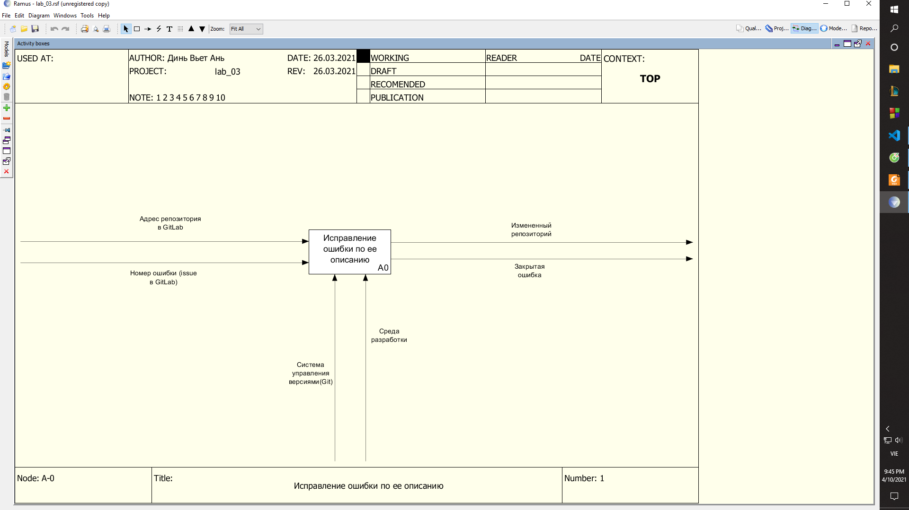
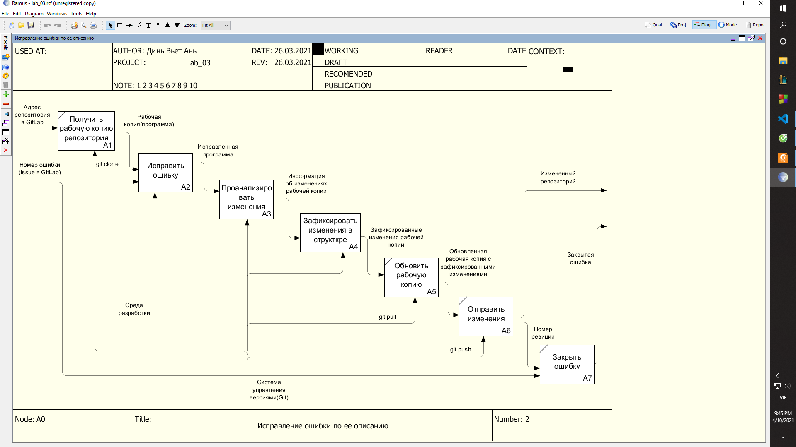
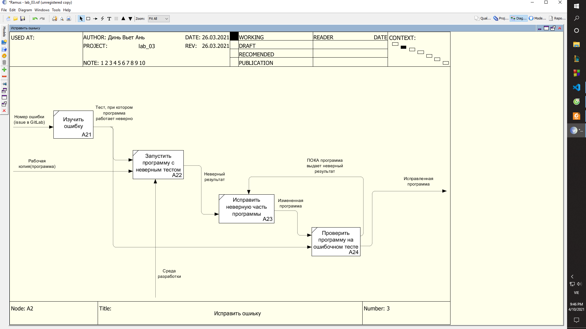
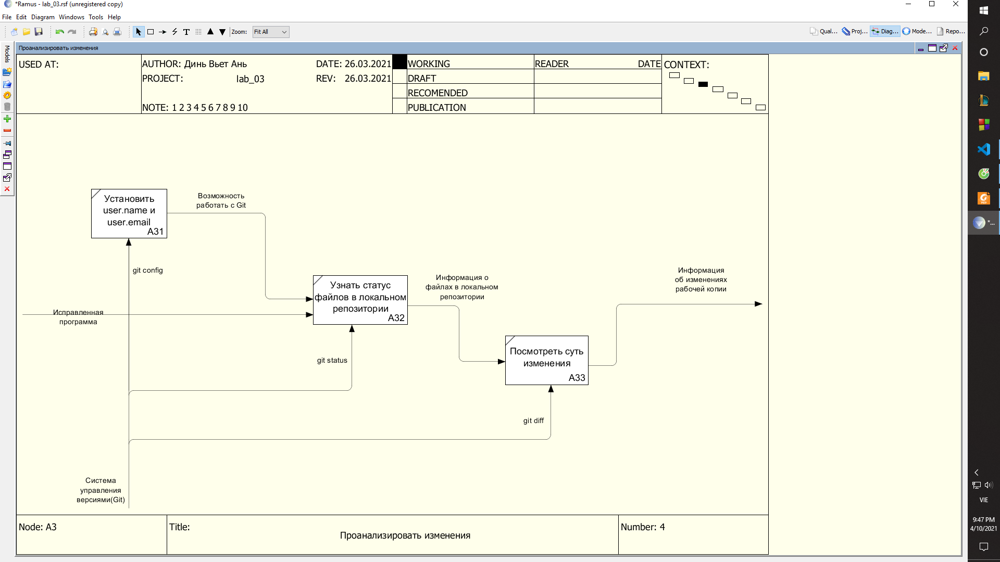
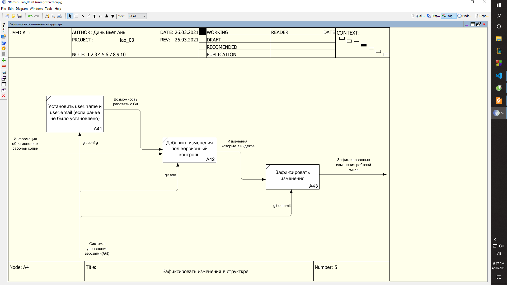

# Лабораторная работа 3 

Документ `*.rsf` лежит в ветке [lab_03](https://git.iu7.bmstu.ru/iu7-software-engineering/iu7-software-engineering-labs-2021/iu7-software-engineering-labs-2021-dinhvietanh/-/tree/lab_03/lab_03)

Условие задачи: Исправить ошибку в программе по ее указанному описанию. Входными данными являются адрес репозитория Git и номер ошибки, указанный в Issue в GitLab, выходными – измененный репозиторий и закрытая ошибка.

**Решение** : декомпозиция в формате IDEF0
---
### Уровень 0

**Общая задача (А0)** : Исправить ошибку в программе по ее описанию.
+ Вход: Адрес репозитория в GitLab, номер ошибки (issue в GitLab).
+ Механизмы: Система управления версиями Git, среда разработки.
+ Выход: измененная программа, закрытая ошибка.

Далее данные механизмы, а так же данные на входе используются в соответствие с декомпозиции в формате IDEF0.

---

### Уровень 1

**А1** : Получить рабочую копию можно с помощью команды `git clone`.

**А2** : Смотрите [Уровень 2 (А2)](#A2)

**А3** : Смотрите [Уровень 2 (А3)](#A4)

**А4** : Смотрите [Уровень 2 (А4)](#A6)

**А5** : Обновить рабочую копию `git pull`.

**A6** : Отправить изменения `git push`.

**A7** : Закрыть ошибку.

---

### Уровень 2 (А2)

**A21** : Открыть ошибку можно в разделе `issue` в `GitLab`, там найти нужную ошибку по ее номеру.

**A22** : Из `issue` необходимо взять входные данные, при которых программа выдает неверный результат, и с этими входным даннами запустить программу.

**A23** : Исправить найденную ошибку.

**A24** : Проверить программу на ошибочном тесте.

---

### Уровень 2 (А3)

**A31** : Необходимо установить имя и почту пользователя. Сделать это необходимо с помощью команд `git config user.name` и `git config user.email`.

**A32** : Узнать статус файлов можно с помощью команды `git status`.

**А33** : Посмотреть суть изменения и получить всю необходимую информацию можно с помощью команды `git diff`.

---

### Уровень 2 (A4)

**A41** : Необходимо установить имя и почту пользователя. Сделать это необходимо с помощью команд `git config user.name` и `git config user.email`, если этого не сделали ранее.

**A42** : Добавить под версионный контроль с помощью команды `git add <file>`, где <file> имя необходимого файла.

**A43** : Зафиксировать изменения можно с помощью команды `git commit`.
